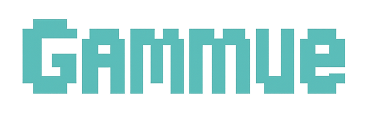

<div id="top"></div>

<div align='center'>

<h1><b>Gammue - 게임 커뮤니티</b></h1>
<h3><b>프로그래머스 4기 5회차 소셜 네트워크 프로젝트</b></h3>

🔗 [배포 링크](https://)



</div>

<br>

## 0. 목차

1. [프로젝트 소개](#1)
2. [팀원 소개](#2)
3. [개발 일정](#3)
4. [기술 스택](#4)
5. [라이브러리 사용 이유](#5)
6. [컨벤션](#6)
7. [브랜치 및 디렉토리 구조](#7)
8. [주요 기능 소개](#8)
9. [상세 담당 업무](#9)
10. [주요 코드 ](#10)
11. [트러블 슈팅](#11)
12. [프로젝트 회고](#12)
13. [시작 가이드](#13)

<br />

## <span id="1">🚩 1. 프로젝트 소개</span>

**Notion**: [프로젝트 노션 링크](https://www.notion.so/2-Gammue-1f8871ecd4fe80a085fcd94e50857de5?pvs=4)

React + TypeScript를 활용하여 게임 커뮤니티용 소셜 네트워크 서비스를 구현.

<br>

<!-- Top Button -->
<p style='background: black; width: 32px; height: 32px; border-radius: 50%; display: flex; justify-content: center; align-items: center; margin-left: auto;'><a href="#top" style='color: white; '>▲</a></p>

<br>

## <span id="2">🏃 2. 팀원 소개</span>

|   |  |  |  |  |
| :---------------------------------------------------------------: | :-----------------------------------------------------------: | :--------------------------------------------------------------: | :-----------------------------------------------------------: | :--------------------------------------------------------------: |
|  |         |            |         |            |
|               [이재건](https://github.com/79gun79)                |            [김은지](https://github.com/keemeunji)             |               [박은서](https://github.com/snowari)               |              [이지윤](https://github.com/wolwha)              |              [최원일](https://github.com/won431236)              |
|                  팀장, 게시글 & 좋아요 구현 구현                  |                 디자인, 커뮤니티 & 알림 구현                  |       외부 API 연결, 인증 & 사이드바 & 구독 & 인기글 구현        |               디자인, 외부 API 연결, 회원 구현                |                         검색 & 댓글 구현                         |

<br>

<!-- Top Button -->
<p style='background: black; width: 32px; height: 32px; border-radius: 50%; display: flex; justify-content: center; align-items: center; margin-left: auto;'><a href="#top" style='color: white; '>▲</a></p>

<br>

## <span id="3">📅 3. 개발 일정</span>

> 프로젝트 개발 기간: 2025.04.25 - 2025.05.19 (25일)

<br>

<!-- Top Button -->
<p style='background: black; width: 32px; height: 32px; border-radius: 50%; display: flex; justify-content: center; align-items: center; margin-left: auto;'><a href="#top" style='color: white; '>▲</a></p>

<br>

## <span id="4">📚 4. 기술 스택</span>

### Environment


### Config


### Development


### Project Management


### Design


### Hosting


### Communication


<br>

<!-- Top Button -->
<p style='background: black; width: 32px; height: 32px; border-radius: 50%; display: flex; justify-content: center; align-items: center; margin-left: auto;'><a href="#top" style='color: white; '>▲</a></p>

<br>

## <span id="5">❓ 5. 라이브러리 사용 이유</span>

> React + TypeScript: 프로젝트 환경

<br>

> Zustand: 전역 상태 설정

<br>

> Axios: API 통신

<br>

> Tailwind CSS: 스타일

<br>

<!-- Top Button -->
<p style='background: black; width: 32px; height: 32px; border-radius: 50%; display: flex; justify-content: center; align-items: center; margin-left: auto;'><a href="#top" style='color: white; '>▲</a></p>

<br>

## <span id="6">🤝 6. 컨벤션</span>

### prettier

```json
{
  "semi": true,
  "singleQuote": true,
  "tabWidth": 2,
  "useTabs": false,
  "plugins": ["prettier-plugin-tailwindcss"]
}
```

### 커밋 컨벤션

| **타입** | **설명**                                     | **깃모지** |
| -------- | -------------------------------------------- | ---------- |
| feat     | 새로운 기능 추가                             | ✨         |
| refactor | 코드 리팩토링                                | 🔨         |
| fix      | 버그 수정                                    | 🐛         |
| chore    | 패키지 매니저, 설정 세팅                     | 📦         |
| init     | 초기 세팅 및 종속성 추가 관련                | 🌱         |
| docs     | 문서 수정                                    | 📝         |
| pencil   | 오탈자 또는 문구, 변수명 수정                | ✏️         |
| zap      | 기능 개선 및 변경                            | ⚡️        |
| poop     | 코드 또는 파일 삭제                          | 💩         |
| design   | 문서 수정                                    | 🎨         |
| style    | 코드 포맷팅, 세미콜론 누락 등 코드 변경 없음 | 💄         |
| test     | 테스트 코드, 리팩토링 테스트 코드 추가       | ✅         |

#### 커밋 예시

- ✨ feat: 페인페이지 레이아웃 구현
- 🐛 fix: 잘못된 날짜 형식 문제 해결

<br>

<!-- Top Button -->
<p style='background: black; width: 32px; height: 32px; border-radius: 50%; display: flex; justify-content: center; align-items: center; margin-left: auto;'><a href="#top" style='color: white; '>▲</a></p>

<br>

## 7.<span id="7"> 🗂️ 브랜치 및 디렉토리 구조</span>

> 브랜치

- `main`: 배포 전용 브랜치, 항상 안정적인 상태 유지
- `dev`: 개발 통합 브랜치, 기능 완성 후 merge
- `feature/기능`: 기능 단위 작업 브랜치, 기능마다 분기해서 작업 진행

<br>

> 디렉토리 구조

```
📂 FiveCoders
├── 📂 src
│   ├── 📂 assets          # 이미지, 아이콘 등 정적 리소스
│   │   ├── 📂 icons
│   │   ├── 📂 imgs
│   ├── 📂 components      # 컴포넌트 관련 파일 (재사용 가능한 UI)
│   ├── 📂 css             # 전역 스타일 모음
│   ├── 📂 data            # 프로젝트 적용을 위한 데이터 파일
│   ├── 📂 pages           # 라우트 단위 페이지 파일
│   ├── 📂 services        # API 통신 모듈
│   ├── 📂 store           # 전역 상태 관리 파일
│   ├── 📂 types           # 타입스크립트 타입 정의
│   ├── 📂 utils           # 유틸리티 파일(함수)
│   └── 📄 App.tsx          # 메인 App 컴포넌트
│   └── 📄 main.tsx
│   └── 📄 router.tsx       # 라우터 설정
├── 📂 public
│   └── 📄 favicon.ico     # 사이트 아이콘
└── 📄 package.json        # 프로젝트 종속성 및 설정 파일
└── 📄 tsconfig.json       # 타입스크립트 설정 파일
```

<br>

<!-- Top Button -->
<p style='background: black; width: 32px; height: 32px; border-radius: 50%; display: flex; justify-content: center; align-items: center; margin-left: auto;'><a href="#top" style='color: white; '>▲</a></p>

<br>

## <span id="8">8. 💻 주요 기능 소개</span>

프로젝트의 주요 기능을 GIF를 첨부하여 설명해주세요.

### 1) 홈

| - 화면                                            | - 화면                                            | - 화면                                            |
| ------------------------------------------------- | ------------------------------------------------- | ------------------------------------------------- |
|  |  |  |

### 2) 게시글

| 상세페이지 화면                                   | 게시물 작성 - ??                                  | 게시물 작성 - ??                                  |
| ------------------------------------------------- | ------------------------------------------------- | ------------------------------------------------- |
|  |  |  |

### 3) 404 & 로딩 화면

| - 화면                                            | - 화면                                            | - 화면                                            |
| ------------------------------------------------- | ------------------------------------------------- | ------------------------------------------------- |
|  |  |  |

<br>

<!-- Top Button -->
<p style='background: black; width: 32px; height: 32px; border-radius: 50%; display: flex; justify-content: center; align-items: center; margin-left: auto;'><a href="#top" style='color: white; '>▲</a></p>

<br>

## <span id="9">9. 📄 상세 담당 업무</span>

### 1) 팀원1 이름

- **🎨 디자인**

  - 로고 디자인 및 이미지 제작

- **💻 화면 개발**

  - 로그인 화면
  - 검색 화면
  - 채팅 화면

- **🧑‍💻 구현 기능**

  - 로딩 페이지
    - 회원가입 후 로그인 모달이 올라오는 로딩페이지
  - 팔로워 목록 및 팔로워 취소&팔로우
    - 팔로워 목록을 getFollowerList로 서버에 요청하여 리스트 출력

- **♻️ 리팩토링**
  - 관련 설명

### 2) 팀원2 이름

- **🎨 디자인**

  - 전체적인 UI 디자인

- **💻 화면 개발**

  - 공통 헤더 네브바
  - 공통 푸터 네브바
  - 삭제 / 신고 모달창

- **👩‍💻 구현 기능**

  - 라우터 초기 셋팅
  - 게시물 등록
    - 토글 Open, Close에 따라 인풋창 높이 자동 조절
    - api 전송 한계로 인해 한 공간에 저장하여 보낼 수 있게, 데이터를 연산자로 구분하여 한줄로 전송
      이미지 추가 및 삭제 가능
  - 게시글 삭제 / 신고
    - userId를 통해 유저를 구별하여 타인의 경우 신고 기능, 본인일 경우 삭제 기능 구현

- **♻️ 리팩토링**
  - 관련 설명

<br>

<!-- Top Button -->
<p style='background: black; width: 32px; height: 32px; border-radius: 50%; display: flex; justify-content: center; align-items: center; margin-left: auto;'><a href="#top" style='color: white; '>▲</a></p>

<br>

## <span id="10">✨ 10. 주요 코드</span>

<details>
<summary> 주요 코드에 대한 설명을 입력하세요. </summary>

<div>
설명

```tsx

```

</div>
</details>

<br>

<details>
<summary> 주요 코드에 대한 설명을 입력하세요. </summary>

<div>
설명

```tsx

```

</div>
</details>

<br>

<!-- Top Button -->
<p style='background: black; width: 32px; height: 32px; border-radius: 50%; display: flex; justify-content: center; align-items: center; margin-left: auto;'><a href="#top" style='color: white; '>▲</a></p>

<br>

## <span id="11">🚦 11. 트러블 슈팅</span>

<details>
<summary> 트러블 슈팅을 입력하세요. </summary>

<div>

1. 문제 상황 <br />

2. 시도 <br />

3. 해결방안 <br />

</div>
</details>

<br>

<!-- Top Button -->
<p style='background: black; width: 32px; height: 32px; border-radius: 50%; display: flex; justify-content: center; align-items: center; margin-left: auto;'><a href="#top" style='color: white; '>▲</a></p>

<br>

## <span id="12">12. 📝 프로젝트 회고</span>

프로젝트 진행 후 느낀 점과 개선할 점을 적어주세요. 블로그에 작성하셨다면 블로그 링크를 첨부해주세요.

<br>

<!-- Top Button -->
<p style='background: black; width: 32px; height: 32px; border-radius: 50%; display: flex; justify-content: center; align-items: center; margin-left: auto;'><a href="#top" style='color: white; '>▲</a></p>

<br>

## <span id="13">13. 🛠️ 시작 가이드</span>

### Installation

```shell
# 1. 클론하기
$ git clone https://github.com/79gun79/FiveCoders.git .

# 2. 의존성 설치하기
$ npm install

# 3. 개발 서버 실행하기
$ npm run dev
```

<br>

<!-- Top Button -->
<p style='background: black; width: 32px; height: 32px; border-radius: 50%; display: flex; justify-content: center; align-items: center; margin-left: auto;'><a href="#top" style='color: white; '>▲</a></p>
